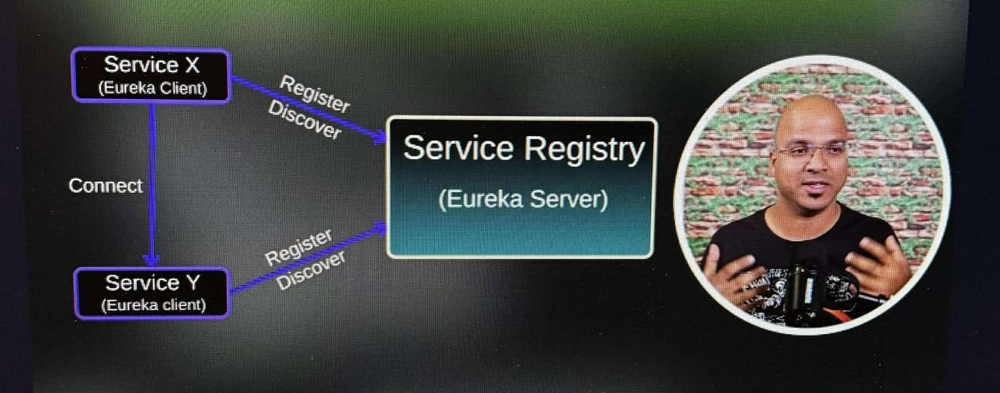

# Microservice_learning

Microservices is an architectural style where an application is structured as a collection of small, independent services that communicate with each other. Each service is designed to handle a specific business function and operates independently, meaning it can be developed, deployed, and scaled separately.

Key Characteristics of Microservices

Independence – Each service runs in its own process and is independently deployable.

Single Responsibility – A service focuses on one business capability (e.g., user authentication, payments, or order processing).

Decentralized Data Management – Each microservice typically has its own database to avoid dependencies.

API-Based Communication – Services communicate via lightweight protocols like HTTP (REST), gRPC, or messaging queues (Kafka, RabbitMQ).

Scalability – Individual services can be scaled independently based on demand.

Technology Agnostic – Services can be built using different programming languages and frameworks as long as they follow communication standards.

.png>)

# Comparison to Monolithic Architecture

| Feature | Monolithic Application | Microservices Architecture |
|---|---|---|
| Deployment | Single unit, all features together | Services deployed independently |
| Scaling | Scale entire application | Scale specific services |
| Flexibility | Difficult to change one part | Easier to update or replace services |
| Technology | Must use the same stack | Can use different stacks per service |
| Data Storage | Shared database | Each service manages its own data |

# neccessary dependencies

- OpenFiegn

    - OpenFeign is a declarative web service client. It simplifies the process of making HTTP requests to other microservices. Instead of writing complex RestTemplate or WebClient code, you define an interface with annotations that describe the API you want to consume. 
  
    - Feign handles the underlying HTTP communication, serialization, and deserialization of data.

- Eureka Discory client

    - The Eureka Discovery Client allows a Spring Boot microservice to register itself with a Eureka Server and discover other registered services.   
    
    - It enables service discovery, which is crucial in a microservice environment where service instances may be dynamically created or destroyed.

- Eureka Server

    - The Eureka Server is a service registry. It acts as a central repository where microservices can register themselves and discover other services.   
    
    - It maintains a list of all registered service instances and their locations.

- Gateway

    - A Gateway acts as a single entry point for all client requests to your microservices. It handles routing, filtering, and other cross-cutting concerns.   
    
    - Spring Cloud Gateway is a popular choice for building API gateways in Spring Boot microservice architectures